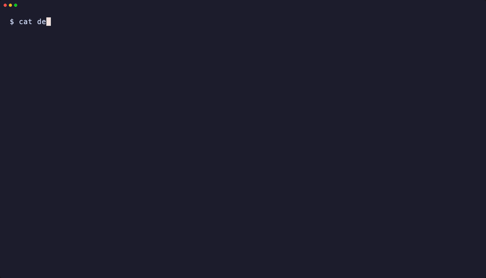

# agentic-team

Orchestrate teams of AI coding agents working in parallel inside tmux sessions.

A **team lead** agent runs interactively and delegates tasks to **worker** agents (Claude, Codex, Gemini) that execute in their own tmux windows. Workers can run in oneshot or interactive mode, each with independent working directories, providers, and models.

```
User ──> team CLI ──> tmux session
                       ├── window 0: Team Lead (interactive)
                       ├── window 1: worker "fix-auth"
                       ├── window 2: worker "add-tests"
                       └── ...
```

## Demo



## Installation

Requires Python 3.13+ and [tmux](https://github.com/tmux/tmux).

```bash
pip install agentic-team
```

Or install from source with [uv](https://docs.astral.sh/uv/):

```bash
git clone https://github.com/guenp/agentic-team.git
cd agentic-team
uv sync
```

You'll also need at least one agent CLI installed:

- [Claude Code](https://docs.anthropic.com/en/docs/claude-code) (`claude`)
- [Codex](https://github.com/openai/codex) (`codex`)
- [Gemini CLI](https://github.com/google-gemini/gemini-cli) (`gemini`)

## Quick start

```bash
# Initialize a team with Claude as the lead
team init myproject --provider claude --working-dir ~/repos/myproject

# Send a task to the team lead
team "fix the auth bug and add tests for the login flow"

# Or attach to the tmux session to interact directly
team attach
```

The team lead agent receives a system prompt that teaches it to spawn and manage workers via the `team` CLI. It will break down your request and delegate subtasks automatically.

## Commands

### Team lifecycle

```bash
# Initialize a new team
team init <name> [--provider claude|codex|gemini] [--model <model>]
                 [--working-dir <path>] [--max-workers 6]
                 [--worker-mode oneshot|interactive]
                 [--permissions auto|default|dangerously-skip-permissions]

# Stop a team and kill its tmux session
team stop [<name>]

# List all teams
team list
```

### Interacting with the lead

```bash
# Send a prompt to the team lead (two equivalent forms)
team "your prompt here"
team send "your prompt here"

# Attach to the tmux session
team attach [--window <name>]

# Tiled dashboard showing all workers side by side
team attach --multi
```

### Managing workers

```bash
# Spawn a worker manually
team spawn-worker --task "description" [--mode oneshot|interactive]
                  [--provider claude|codex|gemini] [--model <model>]
                  [--name custom-name] [--working-dir <path>]

# Check status of all workers
team status

# View worker output
team logs [<name>] [--all] [--tail 50] [--raw]

# Send a message to a running interactive worker
team send-to-worker <name> "message"

# Resume a completed worker with a follow-up
team resume <name> "follow-up prompt"

# Stop a specific worker
team stop-worker <name>
```

### Task files

Define tasks in a markdown file with checkbox syntax:

```markdown
## ~/repos/backend
- [ ] Fix the login bug
- [ ] Add tests for the auth module (provider: codex, mode: oneshot)

## ~/repos/frontend
- [ ] Update the landing page (name: landing)
```

Headings set the working directory. Inline `(key: value)` overrides configure provider, mode, model, or name per task.

```bash
# Spawn workers for all unchecked tasks
team run tasks.md

# Preview what would be spawned
team run tasks.md --dry-run

# Re-run completed tasks
team run tasks.md --rerun

# Sync task file checkboxes from worker status
team sync tasks.md
```

## Worker modes

- **Interactive** (default): The agent starts a persistent session and receives the task via `send-keys`. Supports follow-up messages and stays alive between tasks. Best for most workflows.
- **Oneshot**: The agent runs a single prompt and exits. The session ID is extracted from Claude's JSON output for later resumption via `team resume`.

## Worker names

Workers are named automatically from their task description: a task like "fix the login bug" becomes `fix-login`. If names collide, a numeric suffix is added (`fix-login-2`). You can also set a custom name with `--name` or the `(name: ...)` task file override. Commands that accept a worker name support prefix matching -- `team logs fix` resolves to `fix-login`.

## How it works

1. `team init` creates a detached tmux session with the team lead in window 0.
2. The lead agent receives a system prompt listing available `team` CLI commands.
3. When the lead (or user) runs `team spawn-worker`, a new tmux window is created for the worker with logging via `pipe-pane`.
4. `team status` polls worker liveness by checking tmux pane state, detecting shell prompts (oneshot), or monitoring Claude Code's status bar (interactive).
5. State is persisted in TOML files under `~/.agentic-team/`.

### State directory layout

```
~/.agentic-team/
├── teams/          # Team configs (TOML)
│   └── myproject.toml
├── state/          # Worker state
│   └── myproject/
│       └── workers.toml
├── logs/           # Worker logs
│   └── myproject/
│       ├── lead.log
│       ├── fix-auth.log
│       └── add-tests.log
└── active          # Symlink to active team's state dir
```

## Supported providers

| Provider | CLI | Interactive | Oneshot | Resume |
|----------|-----|------------|---------|--------|
| Claude   | `claude` | `--verbose` | `--print --verbose --output-format json` | `--resume <id>` |
| Codex    | `codex` | *(default)* | `--quiet` | -- |
| Gemini   | `gemini` | *(default)* | `--prompt` | -- |

## License

MIT
