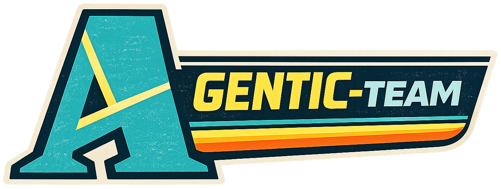

<p align="center">
  
</p>

<p align="center">
  Orchestrate teams of AI coding agents working in parallel inside tmux sessions.
</p>

A **team lead** agent runs interactively and delegates tasks to **worker** agents (Claude, Codex, Gemini) that execute in their own tmux windows. Workers can run in oneshot or interactive mode, each with independent working directories, providers, and models.

```
User ──> team CLI ──> tmux session
                       ├── window 0: Team Lead (interactive)
                       ├── window 1: worker "fix-auth"
                       ├── window 2: worker "add-tests"
                       └── ...
```

## Demo


## Features

- **Conversational delegation**: Talk to the lead agent like a project manager — it breaks down work, spawns workers, monitors progress, and synthesizes results
- **Multi-provider**: Supports Claude Code, Codex, and Gemini CLI agents
- **Parallel execution**: Workers run in isolated tmux windows with automatic logging
- **Two worker modes**: Interactive (persistent, supports follow-ups) and oneshot (fire-and-forget)
- **Task files**: Define batch tasks in markdown with checkbox syntax
- **Smart routing**: `team "your prompt"` sends directly to the lead agent
- **Completion detection**: Automatic status tracking via tmux pane analysis
- **Multi-window dashboard**: `team attach --multi` for a tiled view of all workers
- **Session resumption**: Resume Claude and Gemini sessions manually; completed Claude oneshot workers can also be resumed automatically

## Installation

```bash
pip install agentic-team
```

See [Getting Started](getting-started.md) for prerequisites and first-run setup.

## Read Next

- [Providers](providers.md) for provider-specific setup, flags, and caveats
- [Managing Multiple Teams](multiple-teams.md) for `-T`, `TEAM_NAME`, and stale-team cleanup
- [Commands](commands.md) for the exact Click surface
- [Task Files](task-files.md) for the parser rules and writeback format
- [Operations](operations.md) for logs, lead inspection, and recovery steps
